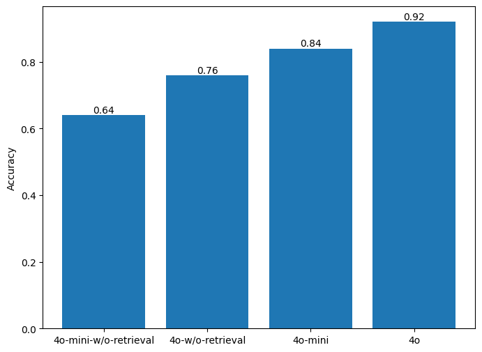

# Introduction

This is a RAG baseline on the PersonaMem benchmark.
It uses BGE-M3 dense embedding for retrieval, and uses LLM for answering questions. 
* Usage: python run.py <top_k> <do_retrieval> <gpt_model>
    * top_k: integer, how many candidate to retrieve in RAG
    * do_retrieval: boolean, whether to do RAG
    * gpt_model: which LLM model to use, currently support {"gpt-4o", "gpt-4o-mini"}

# Requirements:
* questions.csv and contexts.json must exist in ./data
* Packages:
    * numpy==2.2.2
    * pandas==2.2.3
    * FlagEmbedding==1.3.3
    * openai==1.61.1

# Results

Chen, J., Xiao, S., Zhang, P., Luo, K., Lian, D., & Liu, Z. (2024). BGE M3-Embedding: Multi-lingual, multi-functionality, multi-granularity text embeddings through self-knowledge distillation. arXiv. https://arxiv.org/abs/2402.03216

